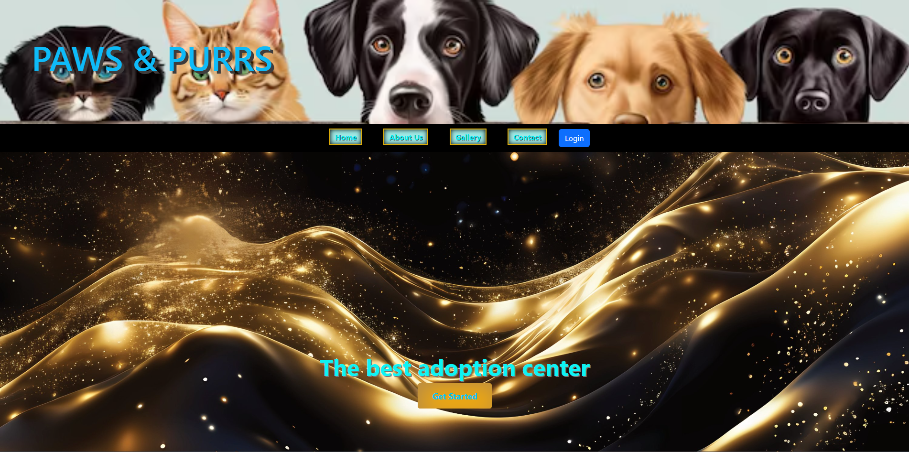

# Non Profit Adoption Center

This is the README file for the Non Profit Adoption Center project. The adoption center is a platform that connects animals in need of a home with loving families. A a nonprofit organization dedicated to rescuing, rehabilitating, and rehoming cats and dogs in need. Founded on the belief that every animal deserves love, care, and a safe home, our mission is to provide a second chance to animals who have been abandoned, neglected, or surrendered.

At [Center Name], we work tirelessly to rescue vulnerable pets, offering them medical care, nourishment, and a temporary home in our shelter. Our passionate team of volunteers and staff also focuses on rehabilitation, ensuring that each animal is not only physically healthy but emotionally ready for their forever home.

Beyond rescue efforts, we strive to educate our community about responsible pet ownership, the importance of spaying/neutering, and advocating for the humane treatment of all animals. We believe that through compassion, education, and action, we can make a lasting difference in the lives of countless cats and dogs.

Every animal we save is a step toward a kinder, more caring world. Whether you're looking to adopt, volunteer, or support our mission, we welcome you to join us in making a difference, one paw at a time.

## Technologies Used

- HTML
- CSS
- JavaScript
- Bulma.CSS
- Bootstrap
- Local Storage

## Non Profit Pets

## Deployed Application

You can access the deployed application [Adoption-Center](https://godray2024.github.io/adoption-center/).
